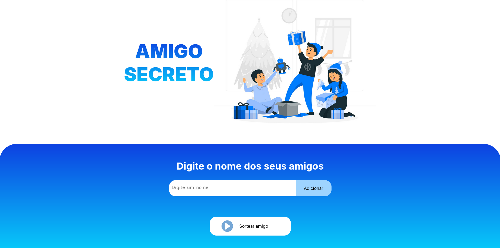

# 🎁 Jogo do Amigo Secreto

Bem-vindo ao **Jogo do Amigo Secreto**, um projeto desenvolvido como parte da trilha de capacitação **Oracle ONE** em parceria com a **Alura**! 🚀



## 🌟 Sobre o Projeto
Este é um jogo interativo de Amigo Secreto feito com **HTML, CSS e JavaScript**. Ele permite que um grupo de amigos ou colegas sorteie seus pares de maneira divertida e dinâmica, sem precisar de papel e caneta!

## 🎮 Funcionalidades
- Adição de amigos á uma lista 📝
- Sorteio de um único amigo 🔀
- Interface amigável e intuitiva 🎨
- Possibilidade de reiniciar o sorteio 🔄

## 🛠️ Tecnologias Utilizadas
- **HTML5** → Estrutura da aplicação
- **CSS3** → Estilização e responsividade
- **JavaScript (ES6+)** → Lógica do jogo e interatividade

## 🚀 Como Executar o Projeto
1. Clone este repositório:
   ```bash
   git clone https://github.com/seu-usuario/amigo-secreto.git
   ```
2. Acesse a pasta do projeto:
   ```bash
   cd amigo-secreto
   ```
3. Abra o arquivo `index.html` no navegador.

## 🎨 Demonstração
Você pode visualizar uma versão funcionando do projeto! [Youtube](https://youtu.be/R0XEZ4mJv10)


💙 Desenvolvido com dedicação durante a trilha **Oracle ONE & Alura** 🚀

